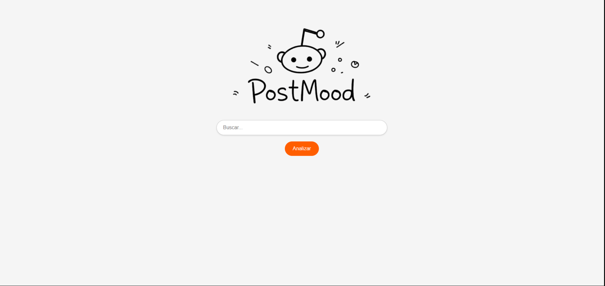

# Postmood

Postmood is a real-time sentiment analysis platform designed to extract,classify, and visualize public opinion from Reddit.
It allows a user to search any keyword and instantly get:
- Aggregated sentiment
- Labeled ezamples from recent post
- Feedback-based corrections that flow into a retraining dataset

---
## **Demo**


---

# **Architecture overview**
Postmood is composed of multiple independent services comunicating over an internal Docker network:

### **Core services**
| Service | Responsibility |
|--------|----------------|
| reddit-worker | Fetches and cleans REddit posts. |
| sentiment-analyzer | Runt NLP model inference. |
| api-gateway | FastAPI entrypoint, caching, DB access, etc.|
| frontend | React dashboard and visualizations. |
| postgres | Stores user feedback for retraining. |
| redis | Queue backend + caching layer. |
| Prometheus | Metrics collection for all services. |

---

## **High-level flow**
````
User → Frontend → API Gateway → RQ Queue → Analyzer Worker
↓
Reddit Worker (posts)
Sentiment Analyzer (labels)
↓
Processed Sentiment Data
↓
Frontend UI
````

---

## **Local installation**

### 1. Clone the repository
```bash
git clone https://github.com/imartinez/postmood.git
cd postmood
```

### 2. Create your `.env` file
Copy the template:
```bash
cp .env.template .env
```
Set your Reddit credentials, customize ports, timeouts, model, etc.

### 3. Start the full stack
```bash
docker compose up --build
```

---

## **Future improvements**
* Model finetuning using user corrections
* Automatic retraining pipeline
